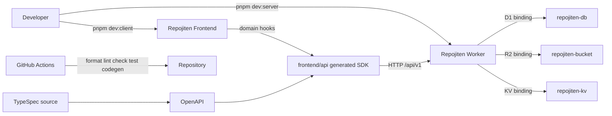
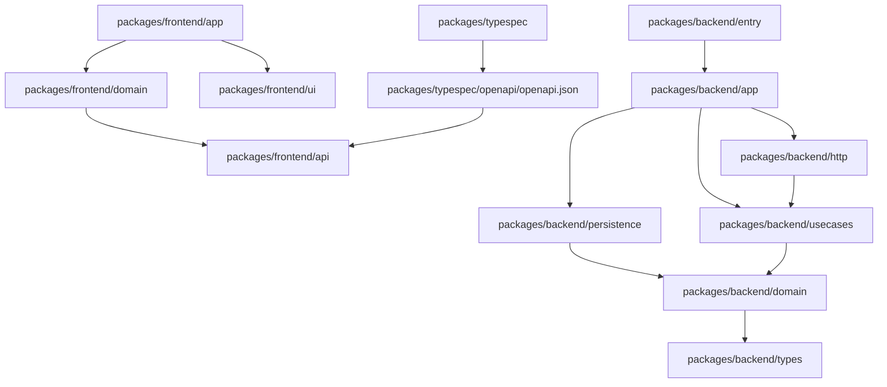
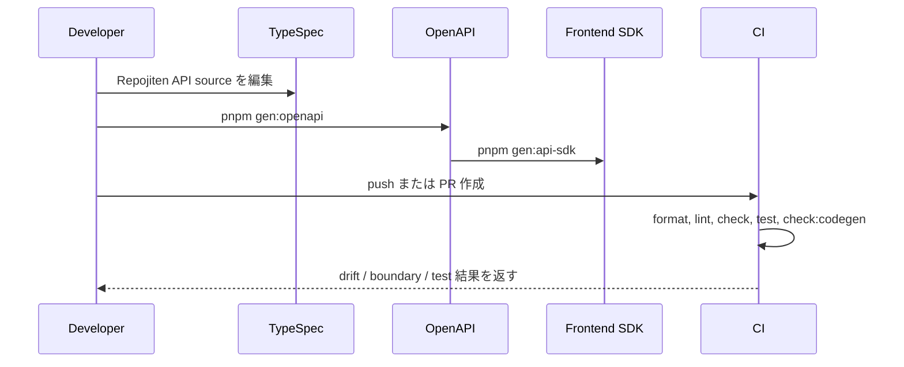
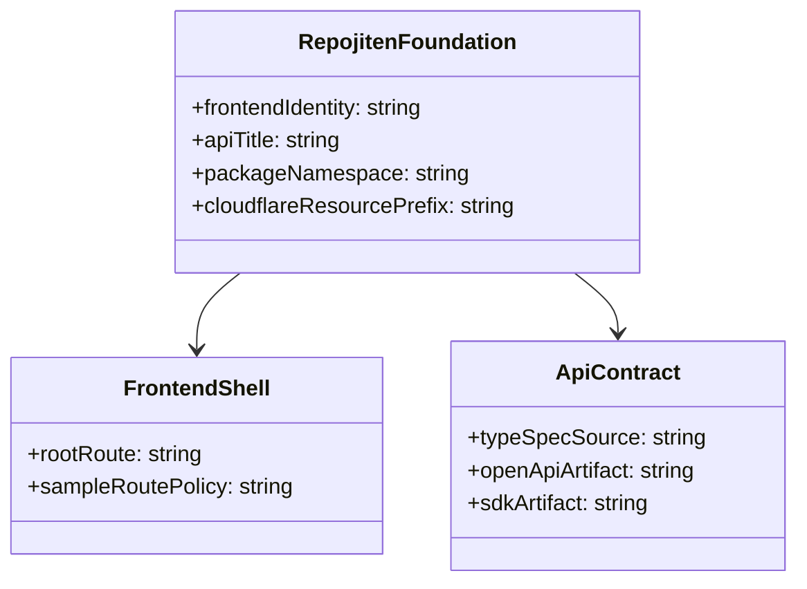
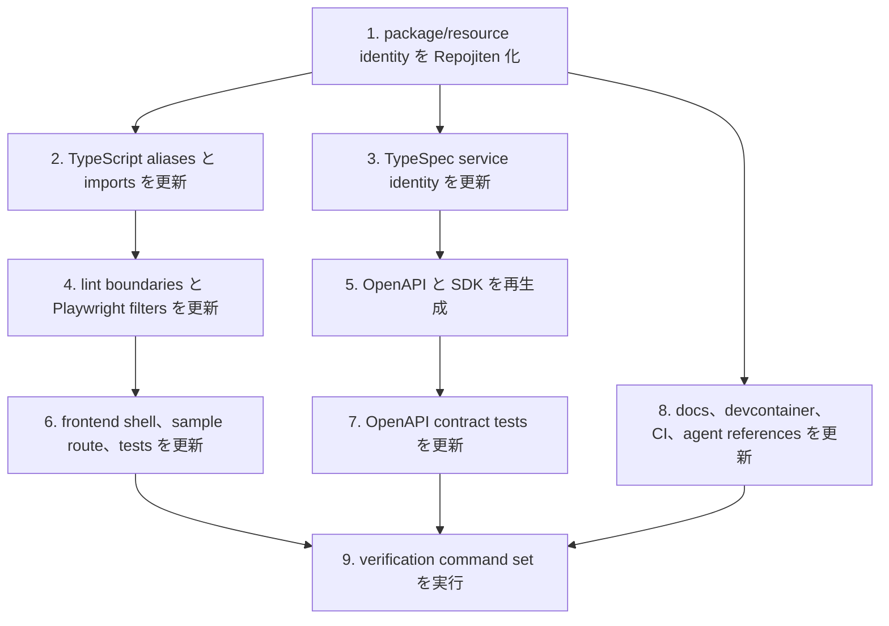

## Scope

### In Scope

- `repojiten-foundation-fe`: Repojiten の app shell、root route、sample UI の扱い、frontend dependency boundary、frontend smoke/E2E を整える。
- `repojiten-foundation-be`: Repojiten の package namespace、backend dependency boundary、TypeSpec/OpenAPI/SDK identity、Cloudflare local resource naming、CI/codegen/docs guardrail を整える。
- GitHub Issue #1 について、`wontfix` label が付いていないことと v0.1 milestone に残っていることを確認する。

### Out of Scope

- GitHub OAuth、Project domain、Repository ingest、Wiki generation、develop webhook、OpenSpec Viewer、Cloudflare Queue/Workflow、AI Chat/DeepResearch。
- D1 の product schema 追加、既存 data migration、production Cloudflare resource の本作成。
- Users CRUD sample を product feature として扱うこと。

## Assumptions / Dependencies

- TypeSpec は API contract の source of truth として維持する。
- OpenAPI と frontend SDK は `pnpm gen:api-sdk` で再生成する。
- package manager は pnpm のままにし、`pnpm-workspace.yaml` の 72 時間 supply-chain guardrail は変更しない。
- v0.1 の主軸 branch は `develop`、CI は `develop` と `main` の両方を保護する。
- 既存 Users CRUD は、後続 Issue で削除または current user flow に変換されるまで sample としてのみ残せる。
- この change は product workflow を追加しないため wireframe artifact は作らない。

## Impacted Areas

- Frontend app: root route、layout branding、document title、sample Users route の見せ方、Playwright smoke。
- Frontend packages: `@repojiten/frontend-*` package names、imports、path aliases、lint boundaries、generated SDK package references。
- Backend packages: `@repojiten/backend-*` package names、imports、path aliases、lint boundaries、Hono/Drizzle/Workers adapter boundaries。
- API contract: TypeSpec namespace/service title、generated OpenAPI、generated SDK、OpenAPI contract test。
- Cloudflare config: Worker、D1、R2、KV naming、binding type consistency。
- CI/local workflow: package scripts、Playwright webServer filters、GitHub Actions triggers/checks、codegen drift check。
- Documentation/agent references: README、CONTRIBUTING、AGENTS、CODING_STANDARDS、OpenCode/coding-guardian references、Dev Container metadata。

## Directory Tree

```text
repojiten
├─ package.json
├─ pnpm-lock.yaml
├─ tsconfig.base.json
├─ eslint.config.js
├─ playwright.config.ts
├─ wrangler.toml
├─ README.md
├─ CONTRIBUTING.md
├─ AGENTS.md
├─ CODING_STANDARDS.md
├─ openspec
│  └─ config.yaml
├─ .github
│  └─ workflows
│     └─ ci.yml
├─ .devcontainer
│  └─ devcontainer.json
├─ .serena
│  └─ project.yml
├─ .opencode
│  ├─ agents
│  │  └─ unit
│  │     └─ frontend
│  │        ├─ designer.md
│  │        └─ engineer.md
│  └─ skills
│     └─ coding-guardian
│        ├─ SKILL.md
│        └─ references
│           └─ repo-entrypoints.md
├─ packages
│  ├─ typespec
│  │  ├─ README.md
│  │  ├─ package.json
│  │  ├─ main.tsp
│  │  ├─ openapi
│  │  │  └─ openapi.json
│  │  └─ src
│  │     ├─ common/errors.tsp
│  │     ├─ models/hello.tsp
│  │     ├─ models/user.tsp
│  │     └─ routes/v1
│  │        ├─ _namespace.tsp
│  │        ├─ hello.tsp
│  │        └─ users.tsp
│  ├─ frontend
│  │  ├─ app
│  │  │  ├─ package.json
│  │  │  ├─ index.html
│  │  │  └─ src
│  │  │     ├─ app.tsx
│  │  │     ├─ main.tsx
│  │  │     ├─ router.tsx
│  │  │     ├─ components/layout/AppLayout.tsx
│  │  │     ├─ pages/home/HomePage.tsx
│  │  │     ├─ pages/users/UsersPage.tsx
│  │  │     ├─ pages/users/UsersPage.test.tsx
│  │  │     └─ tests
│  │  │        ├─ mocks/handlers.ts
│  │  │        └─ utils/test-utils.tsx
│  │  ├─ domain
│  │  │  ├─ package.json
│  │  │  └─ src/hooks
│  │  │     ├─ hello/useHello.ts
│  │  │     └─ users/useUsers.ts
│  │  ├─ api
│  │  │  ├─ package.json
│  │  │  └─ src
│  │  │     ├─ generated/client.ts
│  │  │     └─ api/client.ts
│  │  └─ ui
│  │     ├─ package.json
│  │     ├─ vitest.config.ts
│  │     └─ src
│  │        ├─ hooks/use-toast.ts
│  │        └─ components/ui/*.tsx
│  └─ backend
│     ├─ entry/package.json
│     ├─ app/package.json
│     ├─ http/package.json
│     ├─ persistence/package.json
│     ├─ usecases/package.json
│     ├─ domain/package.json
│     ├─ types/package.json
│     ├─ drizzle/package.json
│     └─ **/src/**/*.ts
└─ tests
   └─ e2e/user-flow.spec.ts
```

## New / Changed Files

| Type     | File                                                              | Change                                                                                                                       |
| -------- | ----------------------------------------------------------------- | ---------------------------------------------------------------------------------------------------------------------------- |
| Update   | `package.json`                                                    | root package 名、scripts、workspace filters、migration command の resource 名を Repojiten に合わせる。                       |
| Update   | `pnpm-lock.yaml`                                                  | workspace package rename と dependency link の結果を反映する。                                                               |
| Update   | `tsconfig.base.json`                                              | frontend/backend path aliases を `@repojiten/*` に変更する。                                                                 |
| Update   | `eslint.config.js`                                                | restricted imports、path groups、boundary messages、generated SDK 除外、stale `theme.ts` 扱いを Repojiten alias に合わせる。 |
| Update   | `playwright.config.ts`                                            | client/server webServer command の workspace filters を Repojiten package 名に変える。                                       |
| Update   | `wrangler.toml`                                                   | Worker、D1、R2、KV resource names を `repojiten` prefix に変える。                                                           |
| Update   | `README.md`                                                       | Repojiten v0.1 の開発者向け入口として全面更新し、古い UI/theme 説明を消す。                                                  |
| Update   | `CONTRIBUTING.md`                                                 | command、package 名、OpenSpec workflow を Repojiten に合わせる。                                                             |
| Update   | `AGENTS.md`                                                       | 有用な規約を残しつつ repository identity と command を Repojiten 向けにする。                                                |
| Update   | `CODING_STANDARDS.md`                                             | package 名、UI stack、generated contract guidance を Repojiten に合わせる。                                                  |
| Update   | `openspec/config.yaml`                                            | project context の repository 名を Repojiten にする。                                                                        |
| Update   | `.github/workflows/ci.yml`                                        | `develop` push trigger を追加し、標準 verification commands を維持する。                                                     |
| Update   | `.devcontainer/devcontainer.json`                                 | container 名を `repojiten` にし、重複 VS Code extension を整理する。                                                         |
| Update   | `.serena/project.yml`                                             | project metadata を Repojiten にする。                                                                                       |
| Update   | `.opencode/agents/unit/frontend/designer.md`                      | frontend agent reference を Repojiten の UI/package identity に合わせる。                                                    |
| Update   | `.opencode/agents/unit/frontend/engineer.md`                      | frontend agent reference を Repojiten の UI/package identity に合わせる。                                                    |
| Update   | `.opencode/skills/coding-guardian/SKILL.md`                       | repo entrypoints と package references を Repojiten に合わせる。                                                             |
| Update   | `.opencode/skills/coding-guardian/references/repo-entrypoints.md` | stale `theme.ts` / template references を消し、実在 entrypoints を書く。                                                     |
| Update   | `packages/typespec/README.md`                                     | TypeSpec command と service identity を Repojiten に合わせる。                                                               |
| Update   | `packages/typespec/package.json`                                  | TypeSpec workspace package を `@repojiten/typespec` にする。                                                                 |
| Update   | `packages/typespec/main.tsp`                                      | TypeSpec namespace と service title を Repojiten にする。                                                                    |
| Update   | `packages/typespec/src/**/*.tsp`                                  | namespaces/imports/comments を Repojiten API identity に合わせる。                                                           |
| Generate | `packages/typespec/openapi/openapi.json`                          | TypeSpec から `Repojiten API` identity の OpenAPI を再生成する。                                                             |
| Update   | `packages/frontend/app/package.json`                              | workspace package と dependencies を Repojiten 名に変える。                                                                  |
| Update   | `packages/frontend/app/index.html`                                | document title を Repojiten にする。                                                                                         |
| Update   | `packages/frontend/app/src/app.tsx`                               | provider import を Repojiten alias に変える。                                                                                |
| Update   | `packages/frontend/app/src/main.tsx`                              | UI stylesheet import alias を変える。                                                                                        |
| Update   | `packages/frontend/app/src/router.tsx`                            | root route を primary entrypoint とし、sample route の扱いを明確にする。                                                     |
| Update   | `packages/frontend/app/src/components/layout/AppLayout.tsx`       | app shell と navigation の表示を Repojiten にする。                                                                          |
| Update   | `packages/frontend/app/src/pages/home/HomePage.tsx`               | root screen を Repojiten v0.1 entry/smoke target にする。                                                                    |
| Update   | `packages/frontend/app/src/pages/users/UsersPage.tsx`             | Users UI を残す場合は sample と分かる表示にする。                                                                            |
| Update   | `packages/frontend/app/src/pages/users/UsersPage.test.tsx`        | sample-scoped Users page の期待値に合わせる。                                                                                |
| Update   | `packages/frontend/app/src/tests/mocks/handlers.ts`               | Users mocks を sample route tests 用として維持する。                                                                         |
| Update   | `packages/frontend/app/src/tests/utils/test-utils.tsx`            | UI import alias を変える。                                                                                                   |
| Update   | `packages/frontend/domain/package.json`                           | workspace package/dependency を Repojiten 名に変える。                                                                       |
| Update   | `packages/frontend/domain/src/hooks/**/*.ts`                      | API import aliases を変える。                                                                                                |
| Update   | `packages/frontend/api/package.json`                              | workspace package と generated SDK の context を Repojiten 名に変える。                                                      |
| Update   | `packages/frontend/api/src/api/client.ts`                         | API wrapper exports を Repojiten package identity 下で維持する。                                                             |
| Generate | `packages/frontend/api/src/generated/client.ts`                   | Repojiten OpenAPI から SDK を再生成する。                                                                                    |
| Update   | `packages/frontend/ui/package.json`                               | shared UI package を `@repojiten/frontend-ui` にする。                                                                       |
| Update   | `packages/frontend/ui/vitest.config.ts`                           | stale theme-specific exclusions を削除または実在 file に合わせる。                                                           |
| Update   | `packages/frontend/ui/src/hooks/use-toast.ts`                     | internal UI import alias を変える。                                                                                          |
| Update   | `packages/frontend/ui/src/components/ui/*.tsx`                    | shadcn/Radix component の internal import alias を Repojiten UI alias に変える。                                             |
| Update   | `packages/backend/*/package.json`                                 | backend workspace packages と workspace dependencies を `@repojiten/backend-*` にする。                                      |
| Update   | `packages/backend/**/src/**/*.ts`                                 | package boundary を保ったまま backend import aliases を変える。                                                              |
| Update   | `packages/backend/types/src/bindings.ts`                          | Wrangler bindings と binding type を一致させる。                                                                             |
| Update   | `packages/backend/http/src/contracts/openapi-contract.test.ts`    | `Repojiten API` を検証し、Scenario ID を test title に入れる。                                                               |
| Update   | `packages/backend/http/src/routes/users.test.ts`                  | Users API を残す場合は sample API behavior の Scenario ID coverage を維持する。                                              |
| Update   | `tests/e2e/user-flow.spec.ts`                                     | E2E smoke を root Repojiten route に変え、Scenario ID を test title に入れる。                                               |

## System Diagram



## Package Diagram



## Sequence Diagram



## UI Wireframes

N/A - wireframe は未生成。この change は product workflow を追加せず、初期 shell と smoke target を定義するだけのため。

## Domain Model Diagram



## ER Diagram

N/A - DB schema は変更しない。

## Package-Level Design

### Package List

| Package                        | Purpose / Responsibility                                              | Public API                                   | Dependencies                                                |
| ------------------------------ | --------------------------------------------------------------------- | -------------------------------------------- | ----------------------------------------------------------- |
| `packages/frontend/app`        | browser entrypoint、routes、app shell、pages、E2E-visible UI を持つ。 | Vite app、router、route components。         | `frontend/domain`, `frontend/ui`。                          |
| `packages/frontend/domain`     | React hooks と client-facing state boundary を持つ。                  | `useHello`、sample を残す場合の `useUsers`。 | `frontend/api`, TanStack Query。                            |
| `packages/frontend/api`        | generated SDK wrapper と API package boundary を持つ。                | generated client と stable wrapper exports。 | OpenAPI generated artifact。                                |
| `packages/frontend/ui`         | Radix/shadcn UI primitives と styles を共有する。                     | component exports、`styles.css`、hooks。     | React、Radix/shadcn dependencies。                          |
| `packages/typespec`            | API contract source と OpenAPI generation を持つ。                    | `main.tsp`、generated `openapi.json`。       | TypeSpec compiler。                                         |
| `packages/backend/entry`       | Cloudflare Worker entrypoint を持つ。                                 | Worker default export。                      | `backend/app`, Cloudflare runtime。                         |
| `packages/backend/app`         | server assembly と dependency wiring を持つ。                         | server factory。                             | `backend/http`, `backend/persistence`, `backend/usecases`。 |
| `packages/backend/http`        | Hono routes、schemas、HTTP contract tests を持つ。                    | route registration、OpenAPI route。          | `backend/usecases`, `backend/types`。                       |
| `packages/backend/usecases`    | application usecase orchestration を持つ。                            | sample Users usecases。                      | `backend/domain`, `backend/types`。                         |
| `packages/backend/domain`      | domain entities、repository interfaces、invariants を持つ。           | sample User domain types。                   | 必要に応じて `backend/types`。                              |
| `packages/backend/persistence` | Drizzle/D1 と external adapter implementations を持つ。               | repository/notifier implementations。        | `backend/domain`, `backend/drizzle`, `backend/types`。      |
| `packages/backend/types`       | Worker binding と shared runtime types を持つ。                       | `Bindings`。                                 | Cloudflare Worker type surface。                            |
| `packages/backend/drizzle`     | Drizzle schema definitions を持つ。                                   | Drizzle schema exports。                     | Drizzle ORM。                                               |

### Details

#### packages/frontend/app

- Purpose / Responsibility: user-visible shell、route selection、smoke-testable root screen を担当する。
- Public API: Vite app entrypoint と route components。
- Key Data Structures: route tree、layout props、page component state。
- Key Flows: user が `/` を開く -> layout が Repojiten shell を表示 -> root page が初期 app state を示す。
- Dependencies: API-facing state は domain hooks 経由、presentation は shared UI 経由にする。
- Error Handling: root smoke path は network-dependent failure を避ける。sample route は loading/error state を局所的に扱う。
- Testing Strategy: Playwright で `[REPOJITEN-FOUNDATION-FE-S005]` を cover し、sample route を残す場合は component test を更新する。
- Non-Functional: root route は local/CI smoke のため auth-free かつ軽量に保つ。
- Performance: root smoke には追加 data fetch を要求しない。
- Security: authentication や sensitive data handling は追加しない。

#### packages/typespec and packages/frontend/api

- Purpose / Responsibility: TypeSpec を source of truth とし、generated API artifacts を同期させる。
- Public API: `packages/typespec/main.tsp`、`packages/typespec/openapi/openapi.json`、generated SDK exports。
- Key Data Structures: OpenAPI document、generated TypeScript client types。
- Key Flows: TypeSpec edit -> OpenAPI generation -> frontend SDK generation -> codegen drift check。
- Dependencies: TypeSpec compiler と frontend API generator。
- Error Handling: contract test と `pnpm check:codegen` が title mismatch / drift を失敗にする。
- Testing Strategy: integration test で `[REPOJITEN-FOUNDATION-BE-S001]`、codegen drift で `[REPOJITEN-FOUNDATION-BE-S002]` を cover する。
- Non-Functional: generated artifacts は deterministic かつ committed にする。
- Performance: generation cost は local/CI のみ。
- Security: runtime API surface は増やさない。

#### backend packages

- Purpose / Responsibility: package identity を Repojiten に変えつつ clean architecture を維持する。
- Public API: Worker entrypoint、server factory、route exports、usecases、domain interfaces、adapter implementations、binding types。
- Key Data Structures: sample User domain objects、repository interfaces、Worker bindings。
- Key Flows: request -> Worker -> app wiring -> HTTP route -> usecase -> domain/repository -> response。
- Dependencies: backend boundary は spec の dependency direction に従う。
- Error Handling: 既存 HTTP/sample error behavior は維持し、boundary drift は lint で止める。
- Testing Strategy: type checking と lint で `[REPOJITEN-FOUNDATION-BE-S003]` / `[REPOJITEN-FOUNDATION-BE-S004]`、HTTP contract test で API identity を cover する。
- Non-Functional: package identity 変更は runtime behavior を変えない。
- Performance: runtime algorithm は変更しない。
- Security: domain/usecase packages は framework/runtime adapter dependencies を持たない。

#### workflow and documentation

- Purpose / Responsibility: local setup、CI、docs を Repojiten baseline に合わせる。
- Public API: README、CONTRIBUTING、AGENTS、coding references、package scripts、CI workflow。
- Key Data Structures: command names、branch triggers、resource names。
- Key Flows: developer が README を読む -> install -> dev/lint/test/codegen を実行 -> CI が core verification を再実行する。
- Dependencies: pnpm、Wrangler、Playwright、Vitest、OpenSpec CLI、GitHub Actions。
- Error Handling: CI/lint commands が formatting、spec coverage、boundary、test、codegen drift を失敗にする。
- Testing Strategy: CI config inspection で `[REPOJITEN-FOUNDATION-BE-S006]`、docs/command validation で `[REPOJITEN-FOUNDATION-BE-S007]` を cover する。
- Non-Functional: documentation は初回入口として読める密度に保つ。
- Performance: CI は既存 timeout 内に収める。
- Security: supply-chain guardrails は維持する。

## Implementation Plan



## Test Plan

### User Acceptance Test (Manual)

| UAT ID                              | Related Requirement                                          | Spec Summary                                                      | Customer Problem Summary                                  | Steps                                                                 | Expected Behavior                                                                   |
| ----------------------------------- | ------------------------------------------------------------ | ----------------------------------------------------------------- | --------------------------------------------------------- | --------------------------------------------------------------------- | ----------------------------------------------------------------------------------- |
| UAT-REPOJITEN-FOUNDATION-FE-HAP-001 | REPOJITEN-FOUNDATION-FE-R001 Repojiten application shell     | root route が Repojiten を識別し、auth なしで smoke test できる。 | product flow が未実装でも開発者が正しい入口を確認できる。 | `pnpm dev:all` を起動し `http://localhost:5173/` を開く。             | page title と visible shell が Repojiten を示し、auth や seeded data を要求しない。 |
| UAT-REPOJITEN-FOUNDATION-FE-REG-002 | REPOJITEN-FOUNDATION-FE-R001 Repojiten application shell     | sample UI が product entrypoint と区別される。                    | sample CRUD を v0.1 product scope と誤認しない。          | app shell から navigation を確認し、必要なら `/users` を開く。        | primary navigation は Repojiten 中心で、Users は sample と分かる。                  |
| UAT-REPOJITEN-FOUNDATION-BE-HAP-001 | REPOJITEN-FOUNDATION-BE-R001 Repojiten API contract identity | API contract と generated SDK が `Repojiten API` を示す。         | 実装者が信頼できる contract identity を判断できる。       | `pnpm gen:api-sdk` を実行し、OpenAPI title と SDK header を確認する。 | 両方の generated artifacts が `Repojiten API` を示す。                              |
| UAT-REPOJITEN-FOUNDATION-BE-SMK-002 | REPOJITEN-FOUNDATION-BE-R004 Development workflow guardrails | docs と scripts が Repojiten commands/resources を使う。          | 新規 contributor が実態と違う setup docs で迷わない。     | README の install、dev、codegen、lint、test commands に従う。         | commands が存在し、Repojiten package/resource names を使う。                        |

### E2E Test (Playwright)

| E2E ID                              | Playwright Test Name                                                      | Related Scenario             | Category | Summary                                                     | Steps (Playwright)                                                   | Expected Behavior                              |
| ----------------------------------- | ------------------------------------------------------------------------- | ---------------------------- | -------- | ----------------------------------------------------------- | -------------------------------------------------------------------- | ---------------------------------------------- |
| E2E-REPOJITEN-FOUNDATION-FE-HAP-001 | `[REPOJITEN-FOUNDATION-FE-S001] root route が Repojiten を識別できる`     | REPOJITEN-FOUNDATION-FE-S001 | HAP      | root route が Repojiten shell を表示する。                  | `/` を開き、title と visible shell text を assert する。             | Repojiten identity が見え、auth は不要。       |
| E2E-REPOJITEN-FOUNDATION-FE-REG-002 | `[REPOJITEN-FOUNDATION-FE-S002] sample UI が primary navigation ではない` | REPOJITEN-FOUNDATION-FE-S002 | REG      | sample Users route を core v0.1 capability として見せない。 | root を開いて nav を確認し、必要なら `/users` を開く。               | sample route が分離または明確に label される。 |
| E2E-REPOJITEN-FOUNDATION-FE-SMK-003 | `[REPOJITEN-FOUNDATION-FE-S005] E2E smoke が initial route を cover する` | REPOJITEN-FOUNDATION-FE-S005 | SMK      | Playwright smoke が stable root route を使う。              | configured web servers を起動し、`/` を開いて shell を assert する。 | Users CRUD data setup に依存せず E2E が通る。  |

### Integration Test (Endpoint)

| IT ID                              | Test Name                                                                     | Genre | Category | Summary                                                            | Steps (Test)                                                                     | Expected Behavior                                                                      |
| ---------------------------------- | ----------------------------------------------------------------------------- | ----- | -------- | ------------------------------------------------------------------ | -------------------------------------------------------------------------------- | -------------------------------------------------------------------------------------- |
| IT-REPOJITEN-FOUNDATION-BE-HAP-001 | `[REPOJITEN-FOUNDATION-BE-S001] OpenAPI contract が Repojiten API を識別する` | be    | HAP      | served/generated OpenAPI が Repojiten title を持つ。               | backend HTTP contract test で OpenAPI document を読む。                          | title が `Repojiten API` で、codegen 後の SDK header も一致する。                      |
| IT-REPOJITEN-FOUNDATION-BE-SMK-002 | `[REPOJITEN-FOUNDATION-BE-S002] codegen に drift がない`                      | be    | SMK      | OpenAPI と SDK を再現できる。                                      | `pnpm check:codegen` を実行する。                                                | command が exit 0 で、generated artifacts に diff がない。                             |
| IT-REPOJITEN-FOUNDATION-BE-REG-003 | `[REPOJITEN-FOUNDATION-BE-S005] Wrangler resources が Repojiten names を使う` | be    | REG      | Cloudflare config が Repojiten resource names を使う。             | config test または review で `wrangler.toml` を確認する。                        | Worker/D1/R2/KV names が `repojiten` prefix を使い、production names が区別できる。    |
| IT-REPOJITEN-FOUNDATION-BE-REG-004 | `[REPOJITEN-FOUNDATION-BE-S006] CI が develop と main branches を保護する`    | other | REG      | CI trigger が PR、develop、main と required checks を cover する。 | `.github/workflows/ci.yml` を lightweight config test または review で確認する。 | workflow に `develop`、`main`、PR trigger、standard verification commands が含まれる。 |

### Unit/Component Test (UT)

| UT ID                              | Test Name                                                                                 | Package           | Category | Summary                                                            | Steps (Test)                                          | Expected Behavior                                                             |
| ---------------------------------- | ----------------------------------------------------------------------------------------- | ----------------- | -------- | ------------------------------------------------------------------ | ----------------------------------------------------- | ----------------------------------------------------------------------------- | ----------- | ------------------------- | -------------------------------------------------------------- |
| UT-REPOJITEN-FOUNDATION-FE-HAP-001 | `[REPOJITEN-FOUNDATION-FE-S003] frontend aliases が Repojiten package names で解決できる` | frontend packages | HAP      | TypeScript が Repojiten frontend aliases を解決する。              | alias rename 後に `pnpm check` を実行する。           | frontend source が `@repojiten/frontend-*` で compile できる。                |
| UT-REPOJITEN-FOUNDATION-FE-BND-002 | `[REPOJITEN-FOUNDATION-FE-S004] app layer が domain hooks を迂回して API call できない`   | eslint            | BND      | app -> API direct import を lint で拒否する。                      | boundary rules 付きで `pnpm lint:eslint` を実行する。 | app layer から direct API import が拒否される。                               |
| UT-REPOJITEN-FOUNDATION-BE-HAP-001 | `[REPOJITEN-FOUNDATION-BE-S003] backend aliases が Repojiten package names で解決できる`  | backend packages  | HAP      | TypeScript が Repojiten backend aliases を解決する。               | alias rename 後に `pnpm check` を実行する。           | backend source が `@repojiten/backend-*` で compile できる。                  |
| UT-REPOJITEN-FOUNDATION-BE-BND-002 | `[REPOJITEN-FOUNDATION-BE-S004] backend boundary violations が拒否される`                 | eslint            | BND      | domain/usecase packages の adapter dependency を lint で拒否する。 | boundary rules 付きで `pnpm lint:eslint` を実行する。 | forbidden dependency direction が Repojiten alias guidance 付きで拒否される。 |
| UT-REPOJITEN-FOUNDATION-BE-REG-003 | `[REPOJITEN-FOUNDATION-BE-S007] documentation が Repojiten commands と一致する`           | docs/scripts      | REG      | documentation と scripts に template package names を残さない。    | docs/config/source に対して `rg "cfreact-template     | @cfreact-template                                                             | Material UI | theme\\.ts"` を実行する。 | active docs/config/source に stale template names が残らない。 |

## Rollback / Migration

- DB migration はない。
- rollback は package/config/docs/codegen changes を通常の git revert で戻し、その後 `pnpm install` で lockfile consistency を戻す。
- codegen output が不整合になった場合は、revert または継続前に `pnpm gen:api-sdk` を再実行する。
- alias change の blast radius が大きい場合は、OpenSpec change scope は維持したまま namespace/config changes、generated artifacts、docs/tests の commit を分ける。

## Release Procedure

1. `corepack enable && pnpm install`
2. `pnpm gen:api-sdk`
3. `pnpm format:check`
4. `pnpm lint`
5. `pnpm check`
6. `pnpm test:run`
7. `pnpm check:codegen`
8. Playwright browser dependencies が利用できる場合は `pnpm test:e2e`
9. GitHub Issue #1 に `wontfix` label がなく、v0.1 milestone に残っていることを確認する。

## Acceptance Criteria

- Repojiten foundation FE/BE の全 Scenario ID に automated coverage または明示的な review coverage がある。
- `rg "cfreact-template|@cfreact-template|CfreactTemplate"` が active source/config/docs references を検出しない。
- TypeSpec service title、OpenAPI title、generated SDK header、contract test が `Repojiten API` を使う。
- root route が Playwright smoke target になり、Repojiten を視覚的に識別できる。
- CI が pull requests と `develop` / `main` への push で実行される。
- `pnpm format:check`、`pnpm lint`、`pnpm check`、`pnpm test:run`、`pnpm check:codegen` が通る。

## Open Issues

N/A - implementation 前に追加で決める product decision はない。
