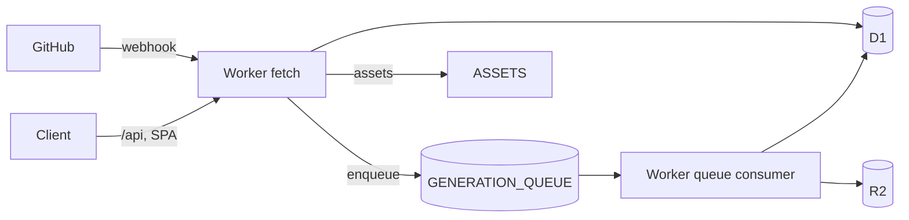
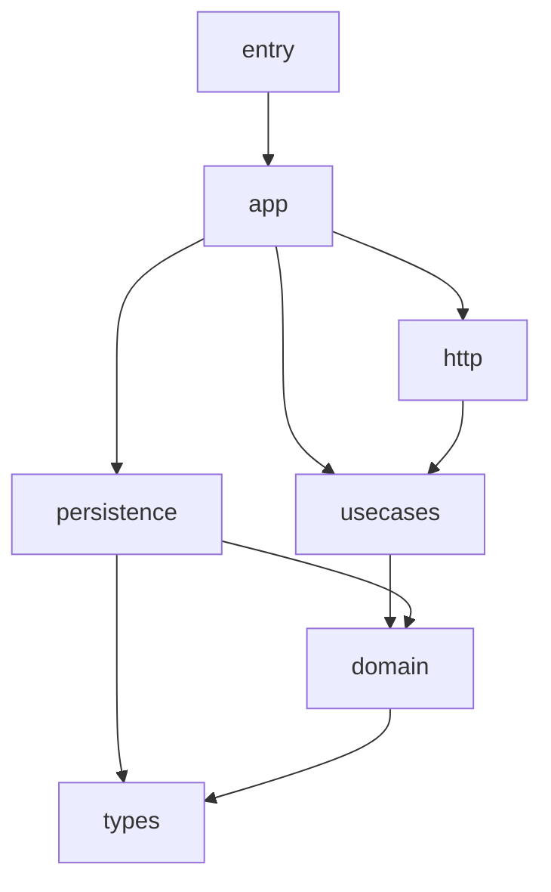
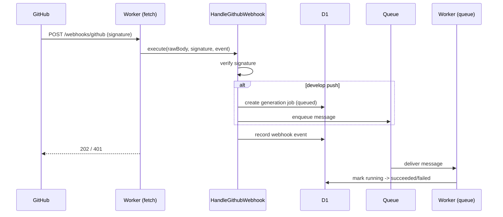

# Design: Repojiten Cloudflare hosting foundation

## Scope

### In Scope

- D1 schema and the initial migration for the v0.1 foundation tables.
- Cloudflare Queues producer/consumer wiring for generation jobs, with job state persisted in D1.
- GitHub webhook intake endpoint with HMAC SHA-256 signature verification (Web Crypto) and develop-push-triggered regeneration enqueue.
- R2 object key scheme and an artifact store (put/get/delete).
- `Bindings`, `wrangler.toml` (queues, static assets, secrets, production env), and `.dev.vars.example`.
- Single-Worker deploy that serves API, webhooks, and the SPA static assets.
- README documentation for Cloudflare resource creation, secrets, and deploy.

### Out of Scope

- Actual repository ingestion and wiki generation logic (#7/#8); the queue consumer uses a placeholder runner.
- GitHub OAuth / session authentication flow (#2); only secret/binding placeholders are added.
- Project / Repository CRUD APIs and UI (#3); only their tables are defined.
- Cloudflare Workflows, multi-region optimization, monitoring/analytics, billing, and a job re-run UI.

## Assumptions / Dependencies

- Builds on the `repojiten-initial-setup` change (Repojiten naming, package boundaries).
- Cloudflare Queues require a Workers paid plan; the dev/test path uses a mockable queue port so tests do not need a real queue.
- `crypto.subtle` and `crypto.randomUUID` are available in the Workers runtime and the vitest workers pool.
- D1 migrations are generated offline with `drizzle-kit generate`; remote apply needs `CLOUDFLARE_*` credentials.
- No production data exists yet, so the initial migration has no data backfill.

## Impacted Areas

- Packages: `backend-types`, `backend-drizzle`, `backend-domain`, `backend-usecases`, `backend-persistence`, `backend-http`, `backend-app`, `backend-entry`.
- External systems: Cloudflare D1, R2, Queues, Workers static assets; GitHub webhooks.
- API: a new non-OpenAPI `POST /webhooks/github` route (outside the `/api/v1` contract surface; the OpenAPI contract is unchanged).
- DB schema: 13 foundation tables added via the initial migration.
- Operational: new queue resources, secrets, and a single-deploy assets configuration.

## Directory Tree

```text
.
├─ wrangler.toml                         # queues, [assets], vars, production env
├─ .gitignore                            # keep dist/.gitkeep tracked
├─ drizzle/migrations/0000_*.sql         # initial foundation migration (generated)
├─ .dev.vars.example                     # local secret/env example
├─ README.md                             # Cloudflare resource / secret / deploy steps
└─ packages/
   ├─ frontend/app/dist/.gitkeep         # ensure assets directory exists
   └─ backend/
      ├─ types/src/bindings.ts           # GENERATION_QUEUE, ASSETS, secrets
      ├─ drizzle/src/schema.ts           # 13 foundation tables + row types
      ├─ domain/src/
      │  ├─ generation/                  # job entity, repository/queue/runner ports
      │  ├─ github/                      # signature verify, payload parse, event port
      │  └─ artifacts/                   # object-keys, artifact-store port
      ├─ usecases/src/
      │  ├─ generation/                  # enqueue / process / get job
      │  └─ github/                      # handle-github-webhook
      ├─ persistence/src/
      │  ├─ drizzle/                     # generation-job + webhook-event repositories
      │  ├─ queue/                       # cloudflare-generation-job-queue
      │  └─ r2/                          # r2-artifact-store
      ├─ http/src/
      │  ├─ context.ts                   # AppVariables += githubWebhookUseCases
      │  ├─ routes/github-webhook.ts     # plain Hono webhook route
      │  └─ (tests under src/**)         # generation / webhook / r2 / object-key tests
      ├─ app/src/
      │  ├─ dependencies/generation.ts   # DI + placeholder runner
      │  ├─ dependencies/github.ts       # DI
      │  ├─ queue.ts                     # generation queue consumer
      │  ├─ worker.ts                    # { fetch, queue }
      │  └─ server.ts                    # webhook route + SPA fallback wiring
      └─ entry/src/index.ts              # default export -> worker
```

## New / Changed Files

| Type | File                                                                                     | Change                                                                    |
| ---- | ---------------------------------------------------------------------------------------- | ------------------------------------------------------------------------- |
| Edit | `packages/backend/drizzle/src/schema.ts`                                                 | Define 13 foundation tables and row types.                                |
| New  | `drizzle/migrations/0000_*.sql`                                                          | Generated migration creating the foundation tables.                       |
| Edit | `packages/backend/types/src/bindings.ts`                                                 | Add `GENERATION_QUEUE`, `ASSETS`, GitHub/session secrets, `APP_BASE_URL`. |
| Edit | `wrangler.toml`                                                                          | Add queues, `[assets]`, vars, and production environment.                 |
| New  | `packages/backend/domain/src/generation/*`                                               | Job entity, status, repository/queue/runner ports.                        |
| New  | `packages/backend/domain/src/github/*`                                                   | Signature verification, payload parser, webhook event entity/port.        |
| New  | `packages/backend/domain/src/artifacts/*`                                                | Object key builders and artifact store port.                              |
| New  | `packages/backend/usecases/src/generation/*`                                             | Enqueue / process / get generation job.                                   |
| New  | `packages/backend/usecases/src/github/*`                                                 | Handle GitHub webhook.                                                    |
| New  | `packages/backend/persistence/src/{drizzle,queue,r2}/*`                                  | Job/webhook repositories, queue adapter, R2 store.                        |
| New  | `packages/backend/http/src/routes/github-webhook.ts`                                     | Plain Hono webhook route.                                                 |
| Edit | `packages/backend/http/src/context.ts`                                                   | Add `githubWebhookUseCases` to `AppVariables`.                            |
| New  | `packages/backend/app/src/{dependencies/generation,dependencies/github,queue,worker}.ts` | DI, consumer, worker handler.                                             |
| Edit | `packages/backend/app/src/server.ts`                                                     | Register webhook route + SPA assets fallback.                             |
| Edit | `packages/backend/entry/src/index.ts`                                                    | Export `worker` as default.                                               |
| New  | `.dev.vars.example`                                                                      | Local secret/env example.                                                 |
| Edit | `README.md`                                                                              | Cloudflare resource / secret / deploy documentation.                      |
| New  | `packages/backend/http/src/**/**.test.ts`                                                | Integration/unit tests for S004–S011.                                     |

## System Diagram



## Package Diagram



## Sequence Diagram



## UI Wireframes

N/A — backend hosting change with no new UI screens.

## Package-Level Design

- `backend-domain`: entities and ports only. `verifyGithubSignature` and `parseGithubWebhookPayload` are pure functions; no Cloudflare/Hono/Drizzle imports. Errors are returned as booleans/null rather than thrown for parsing.
- `backend-usecases`: `EnqueueGenerationJob` persists then enqueues; `ProcessGenerationJob` transitions status and rethrows on failure for consumer retry; `HandleGithubWebhook` verifies, conditionally enqueues, then records. Depends on domain ports only.
- `backend-persistence`: Drizzle repositories map rows to domain entities; `CloudflareGenerationJobQueue` and `R2ArtifactStore` wrap bindings. Testing strategy: D1/R2-backed integration tests via the workers pool.
- `backend-http`: `registerGithubWebhookRoutes` adds a plain Hono route reading context-injected use cases; no direct `c.env` access. OpenAPI contract is unchanged.
- `backend-app`: DI factories read `c.env`; queue consumer builds `ProcessGenerationJob` with a placeholder runner; `worker` exposes `{ fetch, queue }`.

## Implementation Plan

```text
schema + migration -> bindings + wrangler
  -> domain (generation/github/artifacts)
    -> usecases (generation, github) -> persistence (repositories, queue, r2)
      -> http webhook route -> app DI + queue consumer + worker -> entry
        -> tests (S004–S011) -> docs
```

Parallelizable: artifacts (R2) work is independent of the webhook/job chain and can proceed alongside it.

## Test Plan

### User Acceptance Test (Manual)

| UAT ID                           | Related Requirement                                        | Spec Summary                                        | Customer Problem Summary                                | Steps                                                 | Expected Behavior                                                             |
| -------------------------------- | ---------------------------------------------------------- | --------------------------------------------------- | ------------------------------------------------------- | ----------------------------------------------------- | ----------------------------------------------------------------------------- |
| UAT-REPOJITEN-HOSTING-BE-SMK-001 | REPOJITEN-HOSTING-BE-R001 Cloudflare hosting configuration | Bindings are Repojiten-named for default/production | Operators must tell which resources belong to Repojiten | Read `wrangler.toml`; run `wrangler deploy --dry-run` | All bindings resolve with Repojiten names; production differs from default    |
| UAT-REPOJITEN-HOSTING-BE-SMK-002 | REPOJITEN-HOSTING-BE-R001 Cloudflare hosting configuration | One Worker serves API + SPA                         | Split deploys are hard to reproduce                     | `pnpm build` then `wrangler deploy`                   | A single Worker serves API/webhook/SPA; client routes fall back to index.html |
| UAT-REPOJITEN-HOSTING-BE-REG-001 | REPOJITEN-HOSTING-BE-R002 Persistent data model            | Migration creates foundation tables                 | Later features need a shared data model                 | `pnpm migrate:generate`; apply to local/remote D1     | Foundation tables exist, including generation jobs and webhook events         |
| UAT-REPOJITEN-HOSTING-BE-SEC-001 | REPOJITEN-HOSTING-BE-R006 Secrets and environment          | Required secrets documented, not committed          | Members must reproduce env safely                       | Follow README local/production secret steps           | Secrets are documented; no secret values are committed                        |

### E2E Test (Playwright)

| E2E ID | Playwright Test Name | Related Scenario | Category | Summary                                                                            | Steps (Playwright) | Expected Behavior |
| ------ | -------------------- | ---------------- | -------- | ---------------------------------------------------------------------------------- | ------------------ | ----------------- |
| N/A    | N/A                  | N/A              | N/A      | Backend hosting change exposes no new UI flow; verified via integration/unit tests | N/A                | N/A               |

### Integration Test (Endpoint)

| IT ID                           | Test Name                                                                                 | Genre      | Category | Summary                                     | Steps (Test)                                   | Expected Behavior                        |
| ------------------------------- | ----------------------------------------------------------------------------------------- | ---------- | -------- | ------------------------------------------- | ---------------------------------------------- | ---------------------------------------- |
| IT-REPOJITEN-HOSTING-BE-HAP-001 | `[REPOJITEN-HOSTING-BE-S004] enqueue persists a queued job and sends a queue message`     | generation | HAP      | Enqueue persists queued job + sends message | Enqueue via use case with D1 repo + mock queue | Job stored as queued; queue message sent |
| IT-REPOJITEN-HOSTING-BE-HAP-002 | `[REPOJITEN-HOSTING-BE-S005] processing a job records a succeeded terminal state`         | generation | HAP      | Successful processing -> succeeded          | Process a queued job with a resolving runner   | Job status is succeeded in D1            |
| IT-REPOJITEN-HOSTING-BE-ERR-001 | `[REPOJITEN-HOSTING-BE-S006] a failing job is recorded as failed and rethrows for retry`  | generation | ERR      | Failing processing -> failed + rethrow      | Process with a throwing runner                 | Job failed with error; error rethrown    |
| IT-REPOJITEN-HOSTING-BE-SEC-001 | `[REPOJITEN-HOSTING-BE-S007] rejects an invalid signature without enqueuing or recording` | webhook    | SEC      | Bad signature rejected                      | POST webhook with bad signature                | 401; no enqueue; no recorded event       |
| IT-REPOJITEN-HOSTING-BE-HAP-003 | `[REPOJITEN-HOSTING-BE-S008] records a verified develop push and enqueues regeneration`   | webhook    | HAP      | develop push enqueues + records             | POST verified develop push                     | 202 enqueued; event recorded             |
| IT-REPOJITEN-HOSTING-BE-BND-001 | `[REPOJITEN-HOSTING-BE-S009] acknowledges a verified non-develop push without enqueuing`  | webhook    | BND      | non-develop ack only                        | POST verified non-develop push                 | 202 acknowledged; no enqueue             |
| IT-REPOJITEN-HOSTING-BE-HAP-004 | `[REPOJITEN-HOSTING-BE-S011] round-trips a stored artifact`                               | artifacts  | HAP      | R2 put/get/delete round-trip                | Put then get then delete via R2 store          | Stored body returned; null after delete  |

### Unit/Component Test (UT)

| UT ID                           | Test Name                                                                     | Package        | Category | Summary                           | Steps (Test)                 | Expected Behavior                                |
| ------------------------------- | ----------------------------------------------------------------------------- | -------------- | -------- | --------------------------------- | ---------------------------- | ------------------------------------------------ |
| UT-REPOJITEN-HOSTING-BE-HAP-001 | `[REPOJITEN-HOSTING-BE-S010] builds keys that follow the Repojiten R2 scheme` | backend-domain | HAP      | Object key builders follow scheme | Call key builders with a ref | Keys match `projects/{id}/repositories/{id}/...` |

## Rollback / Migration

- Migration: the initial migration only creates tables. Rollback is dropping the created tables (or recreating the D1 database) since there is no data yet.
- Queue/assets: removing the `[[queues.*]]` and `[assets]` blocks and reverting the entry default export restores the prior fetch-only Worker.
- Bindings: the added optional secret fields are backward compatible.

## Release Procedure

1. `pnpm install`
2. `pnpm migrate:generate` (already committed) and apply to the target D1.
3. Create Cloudflare resources (D1, KV, R2, queue `repojiten-generation`, DLQ) and fill ids in `wrangler.toml`.
4. Set secrets: `wrangler secret put GITHUB_WEBHOOK_SECRET` (and OAuth/session secrets when #2 lands).
5. `pnpm build` then `wrangler deploy`.
6. Configure the GitHub webhook to `POST /webhooks/github` with the shared secret.

## Acceptance Criteria

- `wrangler deploy --dry-run` resolves all bindings (D1/KV/R2/queue/assets).
- `pnpm migrate:generate` produces a migration covering all foundation tables.
- Generation jobs can be enqueued and their status persisted/queried in D1.
- The webhook endpoint rejects invalid signatures and enqueues regeneration on develop pushes.
- `pnpm lint`, `pnpm check`, `pnpm test:run`, and `pnpm check:codegen` pass.

## Open Issues

- The placeholder generation runner marks jobs succeeded without producing artifacts; real ingestion/generation arrives in #7/#8.
- Internal repository id resolution from a webhook's `repository.full_name` is deferred until the Project/Repository model is populated (#3).
